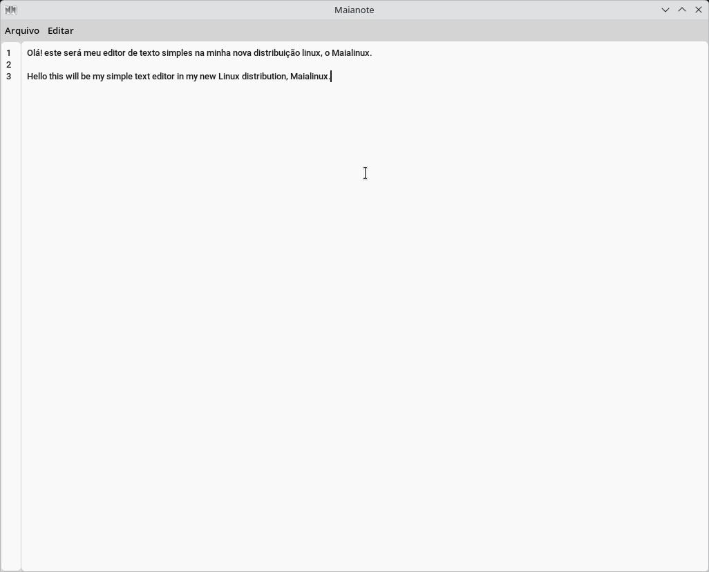
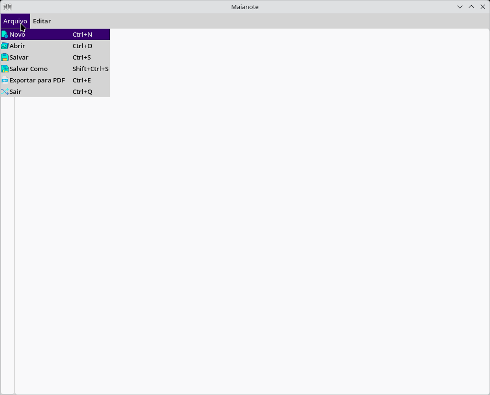
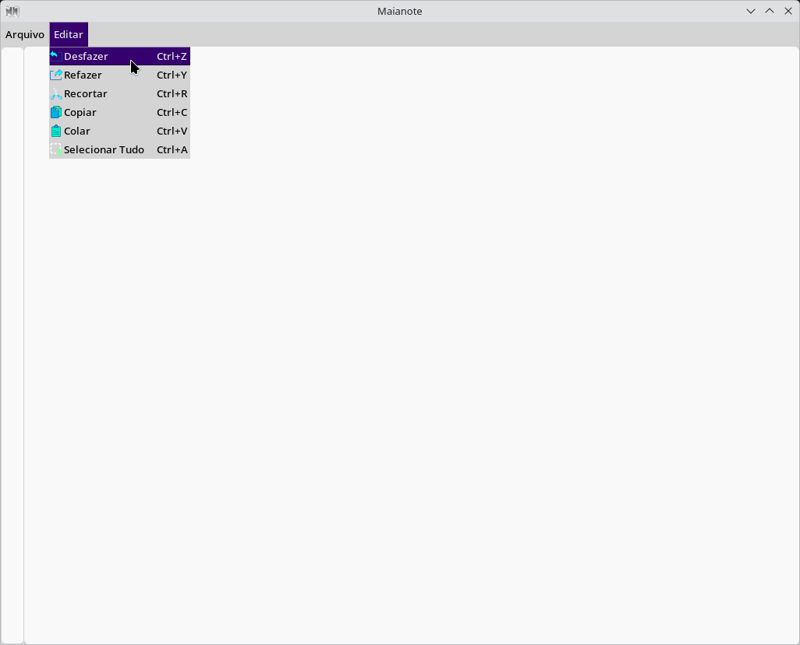

# Maianote

## Editor de texto simples feito no python 3.13.3, utilizando o módulo tkinter com customtkinter no Linux.

## Version: 0.1

### Author: Luiz Eduardo Maia Ribeiro

### Channel: https://www.youtube.com/@l3dpstudios-original

  

  

 

### Apenas um projeto para quem quiser se aventurar ou implementar.

 

  
## Imagens do Maia Note 
 

 

 

  

### Para executar o Maia Note, faça o recomendado:

### Crie o ambiente virtual:
    
    python -m venv virtual

### Entre nesse ambiente:
    
    source ./virtual/bin/activate -> para linux
    
    .\virtual\Scripts\activate -> para windows

### Abra o programa executando o programa main.py

    python main.py
    
